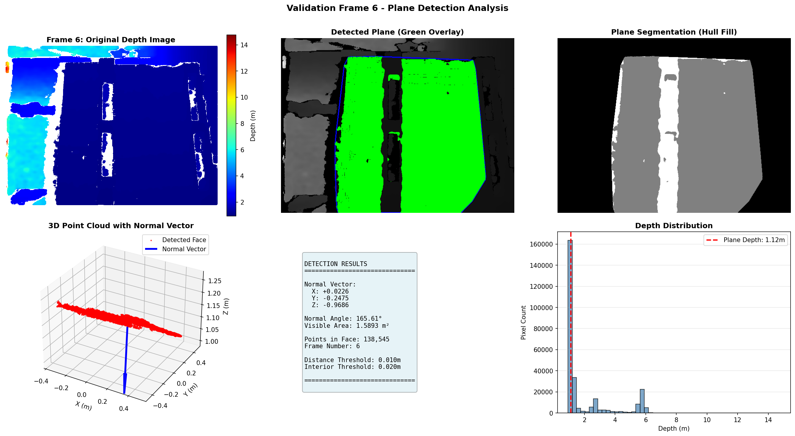

# Cuboid Rotation Analysis from Depth Sensor Data

A CV solution for estimating the 3D rotation of a cuboid using depth image processing and plane segmentation.

[](https://docs.ros.org/en/humble/Releases/Release-Humble-Hawksbill.html)

 

 

---

## 🎯 Overview

This project implements a perception pipeline to analyze the rotation of a 3D cuboidal box from depth sensor data. It processes a stream of depth images to detect the largest visible face, calculate its geometric properties, and estimate the overall axis of rotation.

---

## ✨ Features

- **Plane Detection:** Combines RANSAC with convex hull interior filling for complete face detection.
- **Real-time Analysis:** Processes depth images from a ROS 2 topic.
- **Robust Face Detection:** Two-stage approach with initial RANSAC followed by region filling.
- **Advanced Visualization:** Shows convex hull boundaries and interior points for validation.
- **Geometric Calculation:** Computes accurate face normal angles and visible areas.
- **Rotation Axis Estimation:** Determines the object's rotation axis using PCA on collected face normals.
- **Automated Reporting:** Generates comprehensive output files with detailed visualizations.
- **Configurable Parameters:** Centralized parameter management for easy tuning.
- **Modular Code:** Core processing logic in `final.py`, visualization in `utils.py`.

---

## 💻 System Requirements

- **OS:** Ubuntu 22.04 LTS
- **ROS 2:** Humble Hawksbill
- **Python:** 3.10+
- **Dependencies:** `numpy`, `opencv-python`, `open3d`, `matplotlib`, `scikit-learn`

---

## ROS Bag info

```bash
~/percept$ ros2 bag info depth

Files:             depth.db3
Bag size:          4.1 MiB
Storage id:        sqlite3
Duration:          10.672458040s
Start:             Dec 19 2023 05:46:21.696402893 (1702944981.696402893)
End:               Dec 19 2023 05:46:32.368860933 (1702944992.368860933)
Messages:          7
Topic information: Topic: /depth | Type: sensor_msgs/msg/Image | Count: 7 | Serialization Format: cdr
```

## 🚀 Usage

1.  **Play the ROS 2 Bag File:**
    Open a terminal and play the provided depth data.
    ```bash
    ros2 bag play depth/ --loop
    ```

2.  **Run the Analysis Node:**
    In a second terminal, source your ROS 2 workspace and run the main script.
    ```bash
    # Make sure to source ROS 2 first: source /opt/ros/humble/setup.bash
    python3 final.py
    ```

The script will process frames until it meets a stopping condition (max frames reached or no new faces detected) and then generate the output files.

---

## 📁 Project Structure

```
.
├── final.py                 # Main ROS 2 node for analysis
├── utils.py                 # Helper functions for visualization and reporting
├── README.md                # This file
│
├── depth/                   # Input ROS 2 bag data
│   ├── depth.db3
│   └── metadata.yaml
│
├── submission_outputs/      # Generated analysis results
│   ├── analysis_summary.png
│   ├── assignment_report.txt
│   ├── numerical_results.json
│   ├── results_table.csv
│   ├── results_table.png
│   └── rotation_axis.txt
│
└── validation_frames/       # Per-frame validation images
    └── frame_*.png
```

---


## Processing Pipeline

1. **Point Cloud Generation**
   - Convert depth image to 3D points using camera intrinsics
   - Remove statistical outliers for noise reduction
   - Validate minimum point count requirements

2. **Plane Detection**
   - Initial RANSAC for robust plane model
   - Project inliers to image space
   - Compute and fill convex hull region
   - Collect all interior points satisfying plane equation

3. **Geometric Analysis**
   - Calculate face normal orientation
   - Compute visible surface area
   - Track unique face orientations

4. **Rotation Analysis**
   - Collect unique face normals
   - Apply PCA to normal distribution
   - Extract rotation axis from principal components

## 📊 Visualization

The system generates comprehensive visualizations for each frame:

1. **Original Depth Image:** Raw depth data visualization
2. **Plane Detection:** Shows detected face with convex hull boundary
3. **Segmentation Mask:** Displays filled convex hull region
4. **3D Point Cloud:** Shows points and normal vector
5. **Numerical Results:** Detection parameters and measurements
6. **Depth Distribution:** Histogram of depth values

Additionally, summary visualizations include:
- Normal angle time series
- Visible area measurements
- 3D visualization of face normals
- Statistical distributions
- Rotation axis visualization

## 🔧 Parameter Tuning

Key parameters can be adjusted in `final.py`:

1. **RANSAC Parameters**
   - `ransac_distance_threshold`: Initial plane fitting tolerance
   - `interior_distance_threshold`: Relaxed threshold for interior points
   - `ransac_iterations`: Number of RANSAC iterations

2. **Face Detection**
   - `min_points_for_plane`: Minimum required points
   - `min_inliers_required`: Minimum RANSAC inliers
   - `angle_threshold_deg`: Threshold for unique normals

3. **Processing**
   - `statistical_outlier_neighbors`: Outlier removal parameters
   - `statistical_outlier_std_ratio`: Standard deviation ratio
   - `max_frames`: Maximum frames to process

## 📦 Output Files

- **`submission_outputs/`**: Contains all final reports, numerical data, and summary visualizations as requested for submission.
- **`validation_frames/`**: Contains detailed per-frame visualizations, showing the original depth image, detected plane, and other diagnostic information.

---
