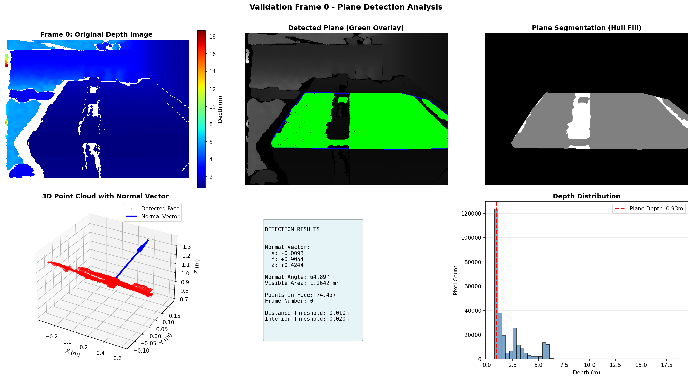
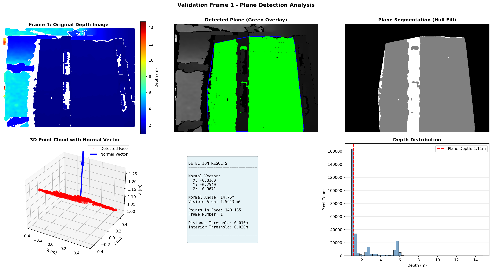

# Cuboid Rotation Analysis from Depth Sensor Data

A CV solution for estimating the 3D rotation of a cuboid using depth image processing and plane segmentation.

[](https://docs.ros.org/en/humble/Releases/Release-Humble-Hawksbill.html)

 

 

---

## 🎯 Overview

This project implements a perception pipeline to analyze the rotation of a 3D cuboidal box from depth sensor data. It processes a stream of depth images to detect the largest visible face, calculate its geometric properties, and estimate the overall axis of rotation.

---

## ✨ Features

- **Real-time Analysis:** Processes depth images from a ROS 2 topic.
- **3D Plane Segmentation:** Uses RANSAC to robustly find the largest planar face.
- **Geometric Calculation:** Computes the face's normal angle and visible area.
- **Rotation Axis Estimation:** Determines the object's rotation axis using PCA on collected face normals.
- **Automated Reporting:** Generates a comprehensive set of output files, including CSV data, summary plots, and validation images.
- **Modular Code:** Core processing logic is separated into `final.py` (ROS node) and `utils.py` (helper functions used for logging results and visualizations).

---

## 💻 System Requirements

- **OS:** Ubuntu 22.04 LTS
- **ROS 2:** Humble Hawksbill
- **Python:** 3.10+
- **Dependencies:** `numpy`, `opencv-python`, `open3d`, `matplotlib`, `scikit-learn`

---

## 🚀 Usage

1.  **Play the ROS 2 Bag File:**
    Open a terminal and play the provided depth data.
    ```bash
    ros2 bag play depth/ --loop
    ```

2.  **Run the Analysis Node:**
    In a second terminal, source your ROS 2 workspace and run the main script.
    ```bash
    # Make sure to source ROS 2 first: source /opt/ros/humble/setup.bash
    python3 final.py
    ```

The script will process frames until it meets a stopping condition (max frames reached or no new faces detected) and then generate the output files.

---

## 📁 Project Structure

```
.
├── final.py                 # Main ROS 2 node for analysis
├── utils.py                 # Helper functions for visualization and reporting
├── README.md                # This file
│
├── depth/                   # Input ROS 2 bag data
│   ├── depth.db3
│   └── metadata.yaml
│
├── submission_outputs/      # Generated analysis results
│   ├── analysis_summary.png
│   ├── assignment_report.txt
│   ├── numerical_results.json
│   ├── results_table.csv
│   ├── results_table.png
│   └── rotation_axis.txt
│
└── validation_frames/       # Per-frame validation images
    └── frame_*.png
```

---

## 📦 Output Files

- **`submission_outputs/`**: Contains all final reports, numerical data, and summary visualizations.
- **`validation_frames/`**: Contains detailed per-frame visualizations, showing the original depth image, detected plane, and other diagnostic information.

---
