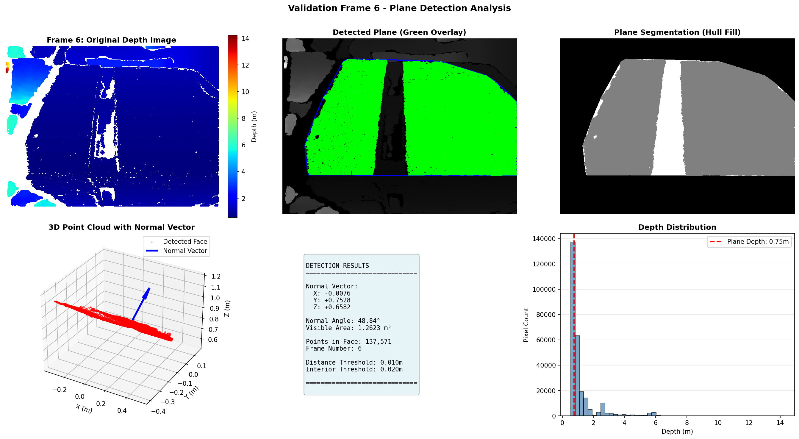

# Cuboid Rotation Analysis from Depth Sensor Data

A CV solution for estimating the 3D rotation of a cuboid using depth image processing and plane segmentation.

[](https://docs.ros.org/en/humble/Releases/Release-Humble-Hawksbill.html)

 

 

---

## 🎯 Overview

This project implements a perception pipeline to analyze the rotation of a 3D cuboidal box from depth sensor data. It processes a stream of depth images to detect the largest visible face, calculate its geometric properties, and estimate the overall axis of rotation.

---

## 💻 System Requirements

- **OS:** Ubuntu 22.04 LTS
- **ROS 2:** Humble Hawksbill
- **Python:** 3.10+
- **Dependencies:** `numpy`, `opencv-python`, `open3d`, `matplotlib`, `scikit-learn`

---

## ROS Bag info

```bash
~/percept$ ros2 bag info depth

Files:             depth.db3
Bag size:          4.1 MiB
Storage id:        sqlite3
Duration:          10.672458040s
Start:             Dec 19 2023 05:46:21.696402893 (1702944981.696402893)
End:               Dec 19 2023 05:46:32.368860933 (1702944992.368860933)
Messages:          7
Topic information: Topic: /depth | Type: sensor_msgs/msg/Image | Count: 7 | Serialization Format: cdr
```

## 🚀 Usage

1.  **Play the ROS 2 Bag File:**
    Open a terminal and play the provided depth data.
    ```bash
    ros2 bag play depth/ --loop
    ```

2.  **Run the Analysis Node:**
    In a second terminal, source your ROS 2 workspace and run the main script.
    ```bash
    # Make sure to source ROS 2 first: source /opt/ros/humble/setup.bash
    python3 final.py
    ```

The script will process frames until it meets a stopping condition (max frames reached or no new faces detected) and then generate the output files.

---

## 📁 Project Structure

```
.
├── final.py                 # Main ROS 2 node for analysis
├── utils.py                 # Helper functions for visualization and reporting
├── README.md                # This file
│
├── depth/                   # Input ROS 2 bag data
│   ├── depth.db3
│   └── metadata.yaml
│
├── submission_outputs/      # Generated analysis results
│   ├── analysis_summary.png
│   ├── assignment_report.txt
│   ├── numerical_results.json
│   ├── results_table.csv
│   ├── results_table.png
│   └── rotation_axis.txt
│
└── validation_frames/       # Per-frame validation images
    └── frame_*.png
```

---


## Processing Pipeline

The core logic processes each depth frame through a multi-stage pipeline to identify the largest cuboid face and its properties.

1.  **Preprocessing: Depth to Point Cloud**
    *   A raw depth image is converted into a 3D point cloud using the camera's intrinsic parameters (focal length, principal point).
    *   Statistical outlier removal is applied to the point cloud to eliminate sensor noise.

2.  **Plane Segmentation: RANSAC + DBSCAN + Convex Hull**
    *   **RANSAC:** The robust RANSAC algorithm is first applied to find the dominant plane in the point cloud, identifying an initial set of inlier points.
    *   **DBSCAN Clustering:** The RANSAC inliers are clustered using DBSCAN to isolate the main connected component, effectively removing disconnected noise points that happen to lie on the same plane. The largest cluster(s) are retained.
    *   **2D Projection & Convex Hull:** The refined inlier points are projected onto the 2D image plane. A convex hull is computed around these 2D points to define the boundary of the visible face.
    *   **Interior Filling:** The algorithm iterates through every point in the original point cloud. Any point that falls within the 2D convex hull and is also close to the original RANSAC plane is considered part of the final face. This "fills in" any holes or sparse regions on the face.

3.  **Geometric Property Calculation**
    *   **Normal Vector:** The normal vector of the plane is determined from the RANSAC model, oriented to point away from the camera.
    *   **Normal Angle:** The angle between the face normal and the camera's viewing axis (Z-axis) is calculated to determine the face's orientation.
    *   **Visible Area:** The surface area of the detected face is computed by creating a 3D convex hull from the final set of inlier points and measuring its area in square meters.

4.  **Temporal Analysis: Rotation Axis Estimation**
    *   **Unique Normal Tracking:** As frames are processed, the normal vector of the detected face is stored only if it represents a new, unique orientation (i.e., the angle to all previously stored normals is above a threshold).
    *   **Principal Component Analysis (PCA):** After collecting a set of unique normals, PCA is applied. The principal component with the *least* variance corresponds to the axis of rotation, as all the normal vectors lie on a plane perpendicular to this axis.
    *   **Axis Normalization:** The resulting vector is normalized to produce the final unit vector representing the axis of rotation.

## 📊 Visualization

The system generates comprehensive visualizations for each frame:

1. **Original Depth Image:** Raw depth data visualization
2. **Plane Detection:** Shows detected face with convex hull boundary
3. **Segmentation Mask:** Displays filled convex hull region
4. **3D Point Cloud:** Shows points and normal vector
5. **Numerical Results:** Detection parameters and measurements
6. **Depth Distribution:** Histogram of depth values

Additionally, summary visualizations include:
- Normal angle time series
- Visible area measurements
- 3D visualization of face normals
- Statistical distributions
- Rotation axis visualization

## 🔧 Parameter Tuning

Key parameters can be adjusted in `final.py`:

1. **RANSAC Parameters**
   - `ransac_distance_threshold`: Initial plane fitting tolerance
   - `interior_distance_threshold`: Relaxed threshold for interior points
   - `ransac_iterations`: Number of RANSAC iterations

2. **Face Detection**
   - `min_points_for_plane`: Minimum required points
   - `min_inliers_required`: Minimum RANSAC inliers
   - `angle_threshold_deg`: Threshold for unique normals

3. **Processing**
   - `statistical_outlier_neighbors`: Outlier removal parameters
   - `statistical_outlier_std_ratio`: Standard deviation ratio
   - `max_frames`: Maximum frames to process

## 📦 Output Files

- **`submission_outputs/`**: Contains all final reports, numerical data, and summary visualizations as requested for submission.
- **`validation_frames/`**: Contains detailed per-frame visualizations, showing the original depth image, detected plane, and other diagnostic information.

---
